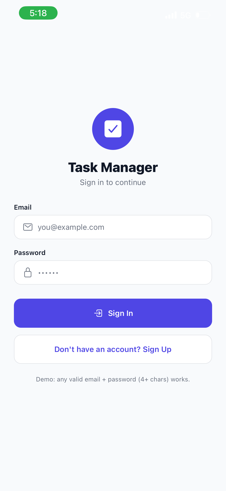
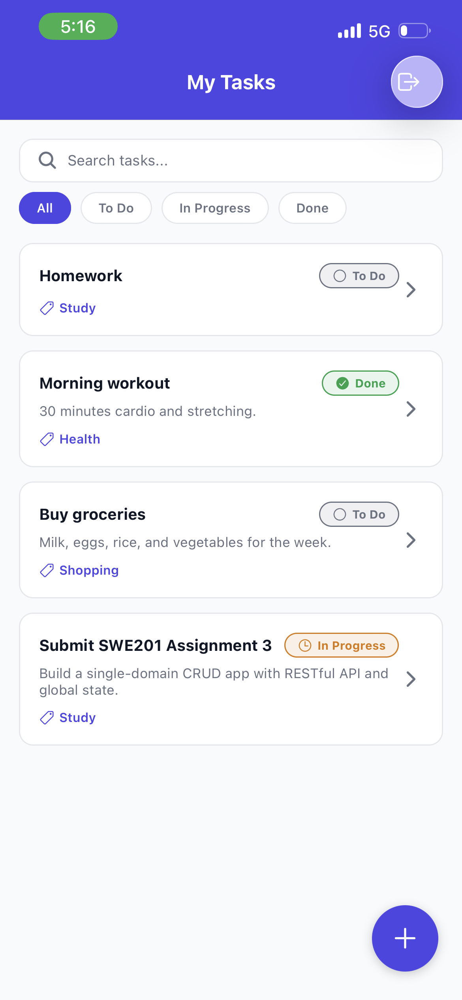
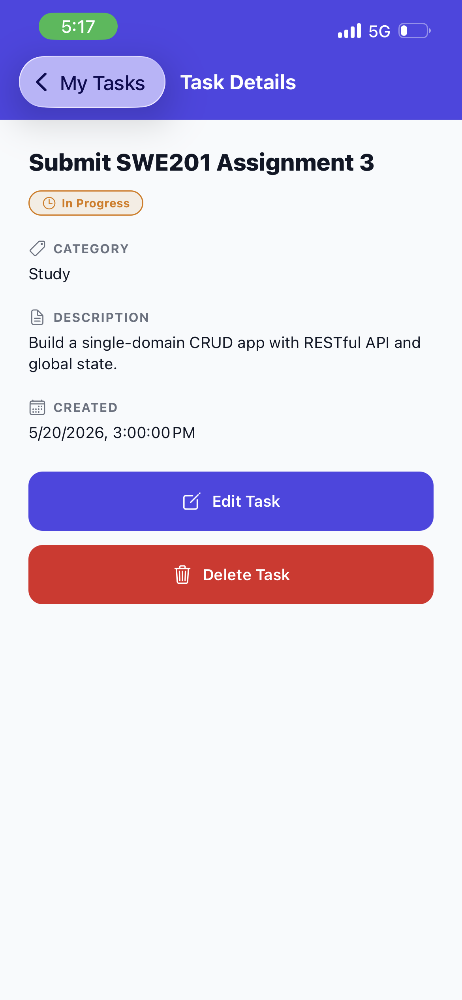
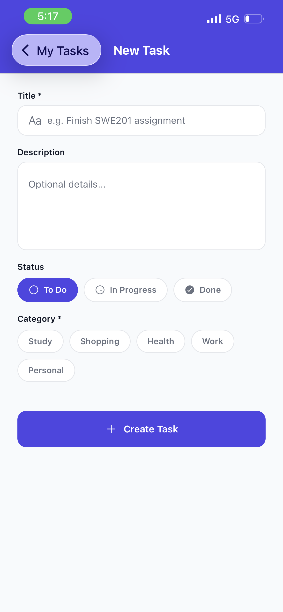
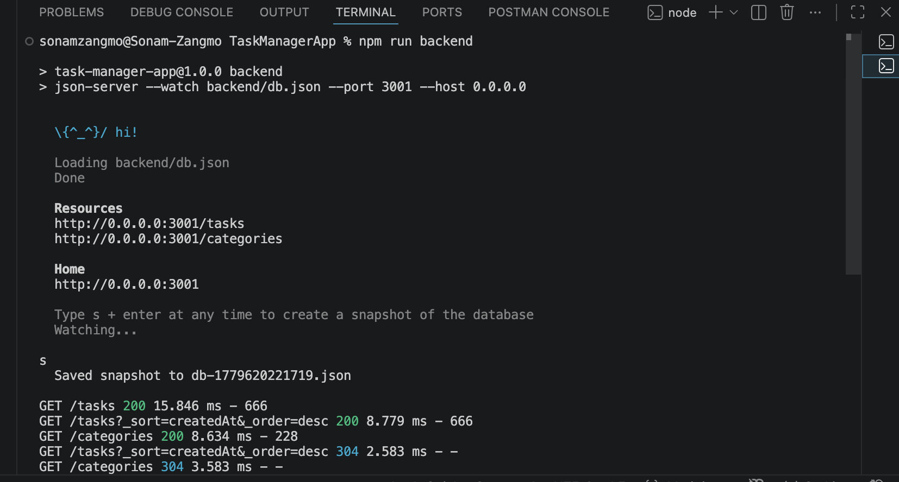

# SWE201 - Assignment 3: Single‑domain CRUD app using RESTful API

# Task Manager 

A single-domain CRUD app for Task Manager. Sign in, then create, read, update, and delete tasks - each belonging to a category - backed by a RESTful API.

## At a glance

| | |
|---|---|
| Domain | Personal Task Manager |
| Primary entity | **Task** (`id`, `title`, `description`, `status`, `categoryId`, `createdAt`) |
| Secondary entity | **Category** (`id`, `name`) - a task belongs to one category |
| Language | TypeScript |
| Stack | Expo SDK 54, React Native 0.81, React 19.1 |
| State | Context API + `useReducer` with selector hooks |
| Persistence | AsyncStorage (auth token + last filter) |
| Backend | JSON Server (mock REST API) |
| HTTP | axios, centralized in `src/api/` |
| Icons | `@expo/vector-icons` (Ionicons) |

## Features

Token-based sign in / sign up; create with client-side validation; list with search and status filtering; single-task detail; edit; delete with confirmation. Loading, empty, and error states everywhere, with distinct messages for validation / server / network failures and a retry button. Three custom hooks: `useAuth`, `useFetchList` (with request cancellation), `useForm`.

## State management - what and why

**Context API + `useReducer`.** The global state is small and bounded (auth, tasks, categories, filter), so this gives a Redux-style reducer/action pattern with **zero extra dependencies**. Screens never touch the store directly - they read through selector hooks (`useTasks`, `useAuthState`, `useTaskById`) and dispatch typed actions, keeping UI and state logic separate. Local UI uses `useState`/`useEffect`.

## Project structure

```
src/
  api/         axios client + tasks / categories / auth services
  components/  reusable UI (Button, InputField, TaskCard, Icon, ...)
  config/      central config (API base URL, constants)
  hooks/       useAuth, useFetchList, useForm
  navigation/  typed route param list
  screens/     Login, List, Detail, Form
  state/       store (Context + reducer) + persistence
  types/       shared domain types
  utils/       validation + theme
backend/       JSON Server db.json
```

## Run it

**Prerequisites:** Node 20+, the **Expo Go** app (or an emulator/simulator).

```bash
npm install          # 1. install dependencies
npm run backend      # 2. terminal A: start mock API on :3001
npm start            # 3. terminal B: start Expo, then scan the QR in Expo Go
```

Emulator shortcuts: `npm run android` / `npm run ios`. Type-check anytime with `npm run typecheck`.

**Physical phone:** open `src/config/index.ts`, set `LAN_IP` to your computer's IP (`ipconfig` / `ifconfig`), and uncomment the manual `API_BASE_URL` override. `localhost` won't reach your machine from a real device. Emulators work with the defaults (`10.0.2.2` for Android, `localhost` for iOS).

**Demo login:** any valid email + a 4+ character password (e.g. `student@swe.com` / `1234`).

## Endpoints

`GET /tasks` · `GET /tasks/:id` · `POST /tasks` · `PATCH /tasks/:id` · `DELETE /tasks/:id` · `GET /categories`

## Screenshots

### **Login Screen** 



- Token-based sign in / sign up with client-side validation.

### **Task List Screen**



- View all tasks with search and status filtering options.

### **Task Detail Screen**



- View task details with options to edit or delete.

### **Task Form Screen**



- Create or edit tasks with category selection and validation.

### **Backend**



- JSON Server mock API running on port 3001.

## Known limitations

Auth is dummy (no real credential check) so the app runs anywhere; the token-injection plumbing is real, so swapping in a live endpoint only means editing `src/api/auth.ts`. JSON Server stores data in a local file, so editing `db.json` resets it.
